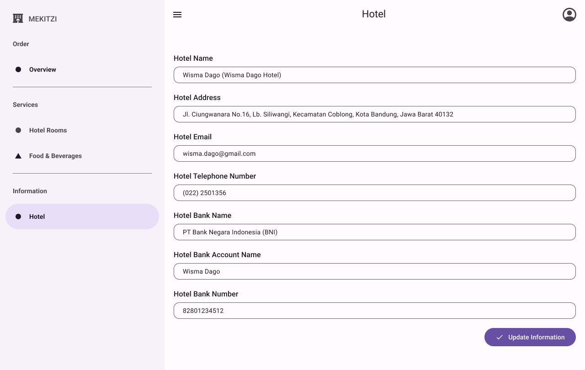

# Mekitzi

### Hotel management Application

Mekitzi adalah sebuah perangkat lunak berbasis aplikasi desktop yang dikembangkan untuk mendukung keberjalanan sistem resepsionis hotel. Perangkat lunak ini akan melayani user untuk memasukkan data pelanggan hotel ke dalam sistem, serta dapat menghasilkan faktur layanan hotel dan laporan umum hotel yang berkaitan dengan histori pemesanan layanan kamar dan layanan makan pelanggan.

### Tujuan

Mekitzi diharapkan dapat meningkatkan customer experience dan customer satisfaction pengguna

## Fitur

Mekitzi mempunyai beberapa fitur utama yaitu:

1. Pengelolaan data hotel
2. Pengelolaan data kamar hotel
3. Pengelolaan data makanan hotel
4. Pengelolaan data pelanggan hotel
5. Pengelolaan pembayaran layanan
6. Faktur pelanggan terkait layanan hotel
7. Pembuatan laporan umum terkait histori pemesanan layanan 

## Layout

